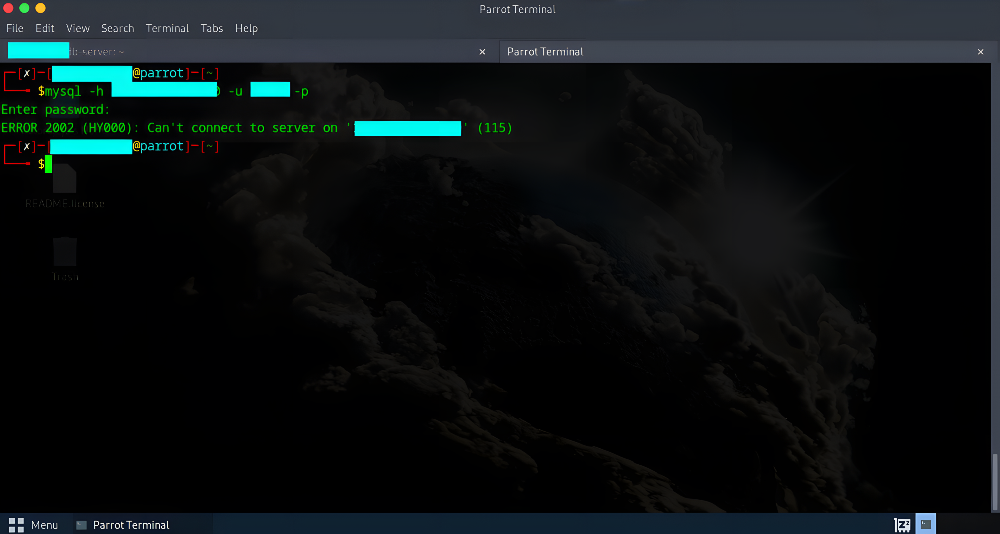
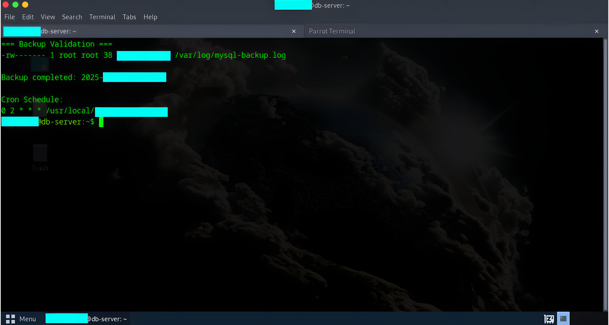

## Client Engagement Summary

This engagement secured a production MariaDB server by eliminating public database exposure and enforcing VPN-only access. All database connectivity is routed through an encrypted WireGuard tunnel, significantly reducing attack surface while maintaining controlled remote access for approved users and applications.

**Delivered Outcome:**

* Zero public exposure of database services
* Encrypted, authenticated access path
* Verified backup and recovery capability

---

## Client Problem Statement

The database server required remote access for operations and applications, but exposing TCP 3306 to the internet introduced unacceptable risk. Internet scanning data consistently ranks MySQL and MariaDB among the most targeted services for brute force and credential attacks.

The client required a solution that:

* Prevented public database access
* Preserved remote connectivity
* Was simple to operate and audit

---

## Solution Overview

A WireGuard VPN gateway was deployed and MariaDB was bound exclusively to the VPN interface. Firewall controls block all direct access from public networks. Only authenticated VPN clients with authorized database accounts can connect.

This design enforces network level isolation before database authentication is even possible.

---

## Engagement Scope

**In Scope**

* Single MariaDB production server
* Secure remote access design
* Firewall and SSH hardening
* Automated database backups
* Verification and validation testing

**Out of Scope**

* Application security testing
* Query performance tuning
* Cloud managed database services
* Endpoint security on client devices

---

## Architecture

```
Authorized Client
        |
Encrypted WireGuard Tunnel
        |
VPN Gateway (10.X.X.1)
        |
MariaDB Server (3306 internal only)
        |
Automated Backups
```

**Network Controls**

* VPN subnet: 10.X.X.0/24
* MariaDB bound to VPN interface only
* No inbound database ports from internet
* SSH restricted to key based access

---

## Technology Stack

* Operating System: Ubuntu Server 25.10
* Database: MariaDB 11.8
* VPN: WireGuard
* Firewall: UFW
* Intrusion Prevention: Fail2ban
* Automation: Bash and Cron

---

## Implemented Controls

### Network Isolation

* Database service inaccessible from public IP space
* Encrypted VPN tunnel required for all access
* Firewall allowlist model enforced

### Access Control

* SSH keys only, passwords disabled
* Database users restricted to VPN subnet
* Principle of least privilege applied

### Availability and Recovery

* Daily automated backups at 02:00
* Seven day retention policy
* Compressed storage to reduce disk usage
* Restoration tested successfully

### Monitoring and Protection

* Fail2ban monitoring SSH access attempts
* Service status verified for VPN, database, and firewall

---

## Validation and Testing

Evidence was captured during implementation and validation to support control effectiveness.

**Verification Performed**

* WireGuard tunnel handshake confirmed
* Database connectivity verified over VPN
* Direct database access from public network blocked
* Backup execution and restoration validated

**Supporting Evidence**


**Architecture diagram showing VPN-only database access**


**Successful VPN database connection proof**



**Failed database connection attempt without VPN**



**ackup creation and retention validation**


**SSH hardening and Fail2ban status confirmation**


**Client VPN Endpoint Demonstration**


---

## Results and Impact

**Security Improvements**

* Public database exposure reduced to zero
* Reduced brute force and exploit attack surface
* Enforced authenticated access path

**Operational Readiness**

* Stable remote access for administrators and services
* Automated backups running daily
* Recovery capability verified

---

## Deliverables Provided

* Secure VPN and database configuration
* Firewall and SSH hardening
* Backup and recovery scripts
* Configuration documentation
* Access and operational procedures

---

## Business Value

This engagement reduced infrastructure risk without increasing operational complexity. The solution aligns with common security control requirements found in internal audits, SOC style reviews, and compliance driven environments.

The design is simple to maintain, auditable, and scalable to additional users or systems.


---

## Contact Information

**Victor Ogechukwu Ojeje**

LinkedIn: https://www.linkedin.com/in/victorojeje/  
Email: ojejevictor@gmail.com  
GitHub: https://github.com/escanut

---

*All IP addresses and credentials shown are sanitized for documentation purposes.*
